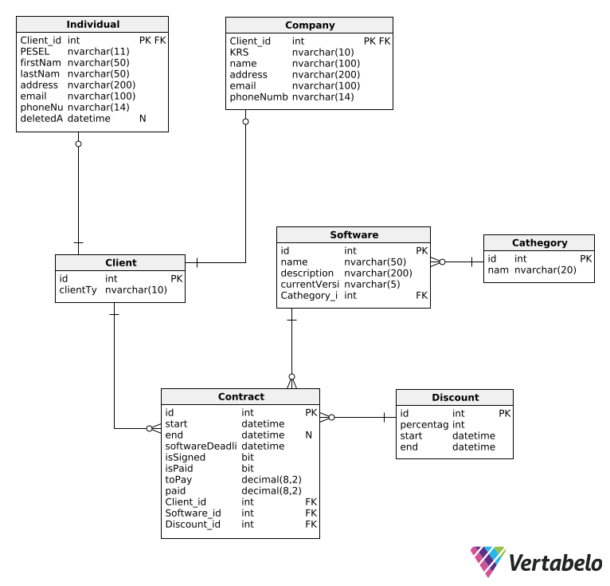

# Revenue Management App

ASP.NET Core Web API for software sales management with role-based authentication, contract processing, and revenue analytics.

## Tech Stack

- **Framework**: ASP.NET Core 6+ Web API
- **Database**: SQL Server + Entity Framework Core (Code First)
- **Authentication**: ASP.NET Core Identity with Cookie Authentication
- **Architecture**: Repository Pattern + Service Layer + Dependency Injection
- **Testing**: xUnit with Fake Repository Pattern
- **Documentation**: Swagger/OpenAPI

## Architecture

```
├── Controllers/         # API Controllers with [Authorize] attributes
├── Services/            # Business logic layer (IClientService, ISalesService)
├── Repositories/        # Data access layer with interfaces
├── Models/              # EF Core entities with fluent configuration
├── DTOs/                # Request/Response data contracts
├── Migrations/          # EF Core database migrations
└── Tests/Fakes/         # In-memory fake repositories for unit testing
```

## Database Design

**Entity Relationships:**



**Key Constraints:**
- Check constraint: `([Individual_PESEL] IS NOT NULL AND [Company_KRS] IS NULL) OR ([Individual_PESEL] IS NULL AND [Company_KRS] IS NOT NULL)`
- Soft delete on Individuals with `DeletedAt` timestamp
- Identity configuration with lockout and custom password policies

## Technical Features

### Authentication & Authorization
```csharp
[Authorize(Roles = "Admin")]  // Admin-only endpoints
[Authorize]                   // Authenticated users
```
- Cookie-based authentication with 8-hour sessions
- Role-based authorization (Admin/Employee)
- Account lockout after 5 failed attempts
- Custom 401/403 JSON responses

### Entity Framework Configuration
```csharp
// Fluent API configuration
entity.HasCheckConstraint("CK_Contract_ClientType", 
    "([Individual_PESEL] IS NOT NULL AND [Company_KRS] IS NULL) OR ([Individual_PESEL] IS NULL AND [Company_KRS] IS NOT NULL)");

// Value object configuration
entity.Property(e => e.Price).HasColumnType("decimal(8, 2)");
entity.Property(e => e.Id).ValueGeneratedNever(); // Manual ID assignment
```

### Repository Pattern Implementation
```csharp
public interface IClientRepository
{
    Task<Individual?> GetIndividualByPeselAsync(string pesel);
    Task<bool> SoftDeleteIndividualAsync(string pesel);
    // ... other CRUD operations
}
```

### Service Layer with Business Logic
```csharp
public async Task<int> CreateContractAsync(ContractDTO contractDto)
{
    // Business rule validation
    // Discount application (highest percentage)
    // Price calculation with additional support
    // Entity creation and persistence
}
```

## API Endpoints

| Method | Endpoint | Auth | Description |
|--------|----------|------|-------------|
| `POST` | `/api/setup/create-admin` | None | One-time admin setup |
| `POST` | `/api/account/register` | None | User registration |
| `POST` | `/api/account/login` | None | Authentication |
| `GET` | `/api/clients` | User | Get all clients |
| `POST` | `/api/clients/individual` | User | Create individual |
| `PATCH` | `/api/clients/individual` | Admin | Update individual |
| `DELETE` | `/api/clients/individual` | Admin | Soft delete individual |
| `POST` | `/api/sales/contract` | User | Create contract |
| `POST` | `/api/sales/contract/payment` | User | Process payment |
| `GET` | `/api/revenue` | User | Revenue analytics with currency conversion |

## Complex Business Logic

### Contract Creation Algorithm
```csharp
// 1. Validate client exists and has no active subscription
// 2. Apply highest percentage active discount
// 3. Calculate: basePrice + (additionalYears * 1000PLN) - discount
// 4. Set software deadline: startDate + 1 year + additionalYears
// 5. Create unsigned contract with calculated total
```

### Revenue Calculation
```csharp
// Current Revenue: SUM(paid) WHERE isPaid=true AND isSigned=true
// Predicted Revenue: CurrentRevenue + SUM(toPay) WHERE isPaid=false AND end > NOW()
```

### Payment Processing with Expiration
```csharp
if (DateTime.Now > contract.End)
{
    await DeleteContractAsync(contract.Id);
    throw new InvalidOperationException($"Contract expired. Refund: {contract.Paid}PLN");
}
```

## Setup & Configuration

### Database Setup
```bash
# Update connection string in appsettings.json
dotnet ef database update
```

### Initial Admin Creation
```bash
curl -X POST https://localhost:7070/api/setup/create-admin
# Creates: admin/Admin123
```

### Configuration
```json
{
  "ConnectionStrings": {
    "DefaultConnection": "Server=localhost;Database=master;..."
  }
}
```

## Testing Architecture

**Fake Repository Pattern:**
```csharp
public class FakeClientRepository : IClientRepository
{
    private readonly List<Individual> _individuals = new();
    // In-memory implementation for testing
}
```

**Test Categories:**
- Unit tests with fake repositories
- Business logic validation
- Revenue calculation scenarios
- Authentication/authorization flows

```bash
dotnet test  # Run all tests
```

## Technical Highlights

### Advanced EF Core Features
- **Fluent API Configuration**: Custom constraints and relationships
- **Value Converters**: Decimal precision for financial data
- **Soft Delete Patterns**: Timestamp-based logical deletion
- **Seeded Data**: Categories and sample software

### HTTP Client Integration
```csharp
// External API integration with fallback
var response = await httpClient.GetStringAsync($"https://api.exchangerate-api.com/v4/latest/PLN");
// Fallback to hardcoded rates on failure
```

### Advanced Validation
- **Model Validation**: Data annotations with custom error messages
- **Business Rule Validation**: Service layer validation
- **Range Constraints**: `[Range(0, 3)]` for additional support years
- **String Length Validation**: PESEL (11), KRS (10), etc.

### Error Handling Strategy
```csharp
try { /* business logic */ }
catch (ArgumentException ex) { return BadRequest(new { message = ex.Message }); }
catch (KeyNotFoundException ex) { return NotFound(new { message = ex.Message }); }
catch (InvalidOperationException ex) { return Conflict(new { message = ex.Message }); }
```

## Performance Considerations

- **Async/Await**: All database operations are asynchronous
- **Query Optimization**: Selective includes with EF Core
- **Connection Pooling**: Built-in with EF Core
- **Stateless Services**: Dependency injection with scoped lifetime

## Development Tools

- **Swagger UI**: `/swagger` endpoint for API testing
- **EF Core Tools**: Database migrations and scaffolding
- **Identity Scaffolding**: Pre-built authentication UI components
- **xUnit Testing**: Comprehensive unit test suite